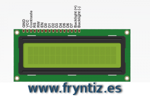

# Librería de Control LCD 1602 con chip HD44780 16x2 Raspberry PI
Pequeña librería para el modelo 1602 chip Hitachi HD44780 con el que trabajar más fácil en este tipo de pantallas de 16 carácteres y 2 líneas.

La mayoría de las pantallas con este chip serán compatibles, aún así el riesgo de usar esta librería y asegurar la compatibilidad de la misma con la pantalla que estés usando no puedo garantizarlo en ningún momento.

Personalmente uso 2 modelos distintos de bajo coste sin problema en casi un año encendida unda de ella.

Mediante los GPIO podemos trabajar de una forma muy sencilla con nuestra raspberry PI, con este script se pretende facilitar el uso de este tipo de pantallas y/o hacer que este funcionando desde el mismo momento en el cual se conecta. También tiene como objetivo servir de apoyo para ser integrado en otros proyectos más ambiciosos como mostrar mensajes de twitter por dicha LCD.




## Información Adicional
Estas pantallas LCD tienen 8 pines de datos (D0-D7) pero no necesitamos conectarlos todos ya que podemos utilizar los pines de la pantalla LCD (D4-D7) para que la información se transmita en paquetes de 4 bits.

De esta forma reducimos notablemente la cantidad de pines en uso para nuestra Raspberry permitiéndonos conectar otra serie de elementos si fuera el caso.


## Dependencias (Solo probado en Raspbian stable)
```Raspbian
sudo apt install raspi-gpio python3-rpi.gpio python3-pigpio python3-gpiozero python-rpi.gpio python-pigpio python-gpiozero pigpio python3-urllib3 python-urllib3
```

## Diagrama de conexión para Raspberry PI 2
El siguiente esquema de conexión es orientativo y no tienes porque hacerlo igual si necesitas usar puertos distintos.

**Esto puede variar en distintos modelos**

Debes prestar atención si tienes otro modelo distinto, en principio entiendo que los modelos Zero, Pi B+, Pi2 y Pi3 deberían ser compatibles con el esquema.

Personalemnte probado en modelos:
* Raspberry Pi ZERO
* Raspberry PI 2 model B

| Pin LCD |  Función | Pin Rpi |   Función   |
|---------|----------|---------|-------------|
|    1    |    GND   |    6    |     GND     |
|    2    |    +5V   |    2    |     +5V     |
|    3    | Contraste|    6    |     GND     |
|    4    |    RS    |    26   |    GPIO-7   |
|    5    |    RW    |    6    |     GND     |
|    6    |    EN    |    6    |     GND     |
|    7    |    D0    |    -    |     GND     |
|    8    |    D1    |    -    |     GND     |
|    9    |    D2    |    -    |     GND     |
|    10   |    D3    |    -    |     GND     |
|    11   |    D4    |    13   |   GPIO-27   |
|    12   |    D5    |    15   |   GPIO-22   |
|    13   |    D6    |    16   |   GPIO-23   |
|    14   |    D7    |    18   |   GPIO-24   |
|    15   |+5V 330ohm|    2    |     +5V     |
|    16   |    GND   |    6    |     GND     |


## Modo de uso
Primero tenemos que importar la librería en nuestro script
```python
    import LCD_LIB_16x2 as LCD
```

En segundo lugar debemos inicializar la pantalla, esto activará los pines GPIO y dejará lista la LCD para transmitirle cadenas a mostrar:
```python
    LCD.lcd_init()
```

Ya la tenemos lista para enviarle cadenas de texto, lo haremos indicando la cadena como primer parámetro en la llamada a la función **lcd_string()** y la línea que publicaremos como segundo parámetro.
```python
    LCD.lcd_string("  Rasbperry Pi ",LCD.LINE_1)
    LCD.lcd_string("16x2 LCD Pruebas",LCD.LINE_2)
```

Por último es recomendable limpiar los pines GPIO como es habitual
```python
    GPIO.cleanup()
```

Hay que tener en cuenta que para ciertas funciones será necesario tener instalado una serie de librerías o herramientas externos normalmente dependientes del sistema operativo.

Esto se especificará en cada script de forma independiente, tendrás que adpatarlo a tu sistema operativo ya que todas las pruebas las hacemos bajo Debian/Raspbian y puede variar la sintaxis de instalación en otros sistemas operativos e incluso el nombre de dichas librerías o herramientas.

## Scripts y Librerías
- LCD_LIB_16x2.py → Librería principal que controla la comunicación con la LCD
- test_interactivo.py → Es un menú interactivo que deja elegir la línea a cambiar y el valor que se desea establecer. Además permite limpiar la pantalla
- test0.py → Es una prueba simple con varios mensajes que cambian cada un tiempo de forma automática. Útil para comprobar si hemos conectado correctamente los pines a nuestra raspberry.
- mostrar_IP.py → Contiene funciones para obtener dirección IP pública con python y además otra función para intentar obtener el País de dicha IP. Además existe una función llamada "mostrar()" que obtiene estos valores anteriores y los pinta en cada una de las líneas.

## Reconocimientos de autoría
La librería **LCD_LIB_16x2** se basa en la del autor **Matt Hawkins** con origen la web de Raspberry-Spy
